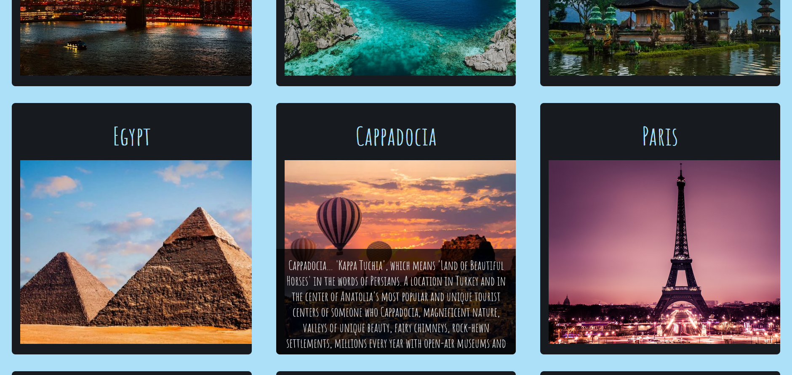

#  :airplane: Trave App :eyeglasses:
> Travel app gives you some beautiful places to visit. You can view detail informations, when you go over the photo!

## Table of contents
  - [Table of contents](#table-of-contents)
  - [General info](#general-info)
  - [Technologies](#technologies)
  - [Features](#features)
  - [How to use](#how-to-use)
  - [Screenshots](#screenshots)
  - [Contact](#contact)

## General info
This project is a React application. It is created to sharpen the knowledge of React.js along with props and state property of React and using local data. It is a part of Team Projects of The Clarusway IT School - Fullstack Developer Path.

## Technologies
* React.js - version 18.2.01
* Sass - version 1.53.0

## Features
* Gives the picture and the name of places in main appearence
* Go on the name/photo to see details and get informations

## How to use
```bash
# Clone this repository
$ git clone https://github.com/i-bilge/travel-app.git

# Go into the travel-app folder (if you are not)
$ cd travel-app

# Install dependencies
$ npm install

# Run the app
$ npm start
```


## Screenshots





## Contact
:mailbox_with_mail: You can send me email : iismailbilge@gmail.com :mailbox_with_mail:
